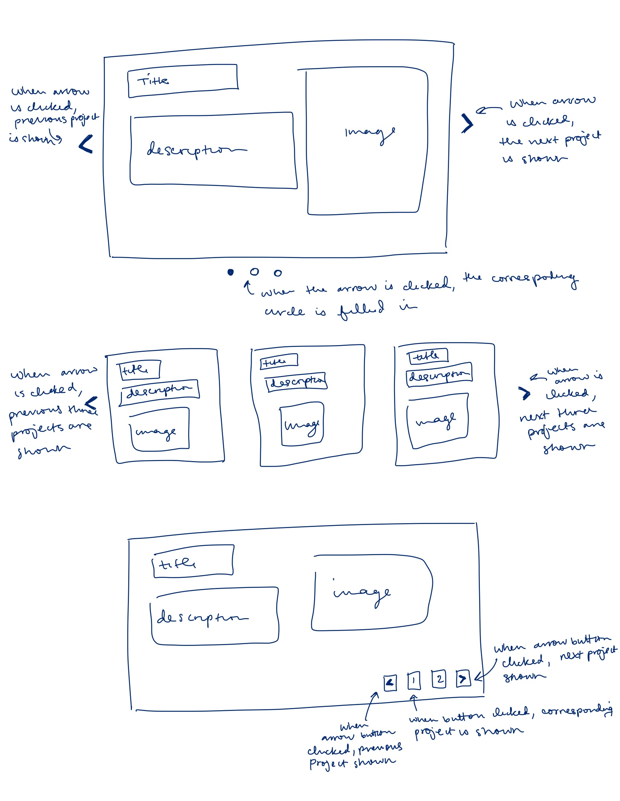
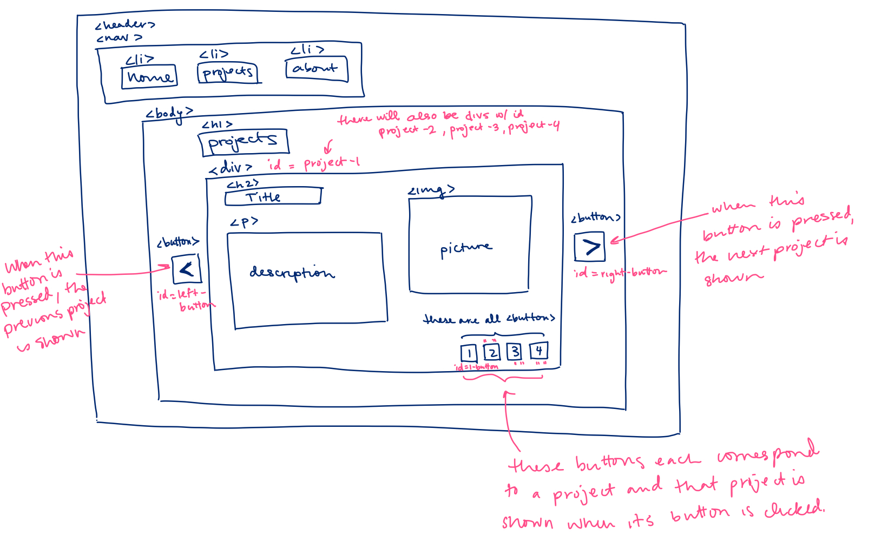

# Project 3: Design Journey

**For each milestone, complete only the sections that are labeled with that milestone.**

**Replace ALL _TODOs_ with your work.** (There should be no TODOs in the final submission.)

Be clear and concise in your writing. Bullets points are encouraged.

**Everything, including images, must be visible in Markdown Preview.** If it's not visible in Markdown Preview, then we won't grade it. We won't give you partial credit either. This is your warning.


# Existing Project

**Tell us about the project you'll be using for Project 3.**

## Project (Milestone 1)
> Which project will you add interactivity to enhance the site's functionality?

Project 1


## Audience (Milestone 1)
> Who is your project site's audience?
> This should be the original audience from Project 1 or Project 2.
> You should adjust the audience if necessary. Just make sure you explain your rationale for doing so here.

The audience is internship/job recruiters in the technology field.


## Audience's Goals (Milestone 1)
> List the audience's goals that you identified in Project 1 or 2.
> Just list each goal. No need to include the "Design Ideas and Choices", etc. You may adjust the goals if necessary. However, any changes you make to the goals for this project should be clearly identified and justified.

- view my credentials
- view my past projects
- make a hiring decision with website taken into account


# Interactivity Design

## Interactivity Brainstorm (Milestone 1)
> Using the audience goals you identified, brainstorm possible options for interactivity to enhance the functionality of the site while also assisting the audience with their goals.
> Briefly explain idea each idea and provide a brief rationale for how the interactivity enhances the site's functionality for the audience.
> Note: You may find it easier to sketch for brainstorming. That's fine too. Do whatever you need to do to explore your ideas.

- Project Carousel - This would make flipping through my projects easier without having to navigate to different pages and then going back to the project page.
- Project Accordian - This would show the basic information of the project and a dropdown for more information, again to make viewing my projects easier.
- Hamburger Menu for projects - This would allow the audience to view a list of my projects and choose which to look at instead of having to navigate to the project page.


## Interactivity Proposal & Rationale (Milestone 1)
> Make a decision about your site's interactivity. Explain what you plan to implement and where it will go on your site.
> Describe the purpose of your proposed interactivity. Provide a brief rationale explaining how your proposed interactivity addresses the goals of your site's audience.

**Interactivity Proposal:** I will implement the project carousel on the projects page. It will flip through the projects so that I don't have to maintain an individual page for each project and the entire description of the project can be shown.  

**User Goals Rational:** The carousel will make viewing my projects easier than before which is one of the audience's goals. Having an easier UI may also help the audience make a decision about hiring in my favor since I implemented the UI.


## Interactivity Design Ideation (Milestone 1)
> Now that you've made a decision about the site's interactivity, explore the possible design solutions for the interactivity.
> Sketch several iterations of your interactivity.
> Annotate each sketch explaining what happens when a user takes an action. (e.g. When user clicks this, this happens.)

<!--Source: Original Work-->



## Final Interactivity Design (Milestone 1)
> Review your sketches from the previous step and pick your final design.
> Create a _polished_ sketch (it's still a sketch, but with a little more care taken to communicate ideas clearly to the graders) to plan your interactivity.
> **Sketch out the entire page where your interactivity will go.** Add your interactivity to the sketch. Add any annotations to explain what happens when the user takes an action.
> Include as many sketches as necessary to communicate your design (ask yourself, could another 1300 take these sketches an implement my design?)

<!--Source: Original Work-->



## "Ambitious" Interactivity Explanation
> In your own words, concisely explain why you believe your interactivity meets the "ambitious" requirement.

The carousel design pattern was listed underneath the ambitious designs and will require reformatting of the HTML structure to implement it.


## Additional Information (Milestone 1)
> (optional) Include any additional information, justifications, or comments we should be aware of.


# Interactivity Implementation Plan (Final Submission)

## HTML Interactivity Plan (Final Submission)
> Plan the HTML elements you will use in your interactivity.
> For each element, give its `id=` (if it has one) and any default styling (`class=`)

- right button: `<button id='right-button' class='button hover'>`
- left button: `<button id='left-button' class='button hover'>`
- first project slide: `<div id='project-1' class='slide'>`
- second project slide: `<div id='project-2' class='slide hidden'>`
- first project button: `<button id='button-1' class='button hover current-slide'>`
- second project button: `<button id='button-2' class='button hover'>`


## CSS Interactivity Plan (Final Submission)
> Plan the CSS classes you will need for your interactivity

- `.hidden` - hide block from view
- `.hover` - change cursor to hand pointer
- `.slide` - style a project slide
- `.current-slide` - style number buttons to highlight which slide is being shown
- `.button` - style buttons

## Interactivity Pseudocode (JavaScript) Plan (Final Submission)
> Write your interactivity pseudocode plan here.

```
index = 0
slides = all slides
buttons = all buttons except #right-button and #left-button

function show(index):
  add .hidden to slides
  remove .hidden from slides(index)
  remove .current-slide from buttons    
  add .current_slide to buttons(index)


when #right-button is clicked:
  index += 1
  show(index)


when #left-button is clicked:
  index -= 1
  show(index)

when #button-1 is clicked:
  index = 0
  show(index)

when #button-2 is clicked:
  index = 1
  show(index)
```


# Grading (Final Submission)

## Interactivity Usability Justification (Final Submission)
> Explain how your design effectively uses affordances, visibility, feedback, and familiarity.

The affordances are the buttons of the carousel: the right and left arrows, and the numbered buttons at the bottom right of the project slide. The right and left arrows indicated that the slide can be changed and the numbered buttons indicate that they correspond to some order of the slides.
For visibility, only one project slide is shown at a time.
The feedback is given by the slide changing once an arrow or numbered button is pressed. There is also subtle feedback when the button is highlighted when hovered over.
The carousel design pattern is a familiar design pattern so that the audience can catch on quick to its purpose.


## Additional Design Justifications (Final Submission)
> If you feel like you haven’t fully explained your design choices in the final submission, or you want to explain some functions in your site (e.g., if you feel like you make a special design choice which might not meet the final requirement), you can use the additional design justifications to justify your design choices. Remember, this is place for you to justify your design choices which you haven’t covered in the design journey. Use it wisely. However, you don’t need to fill out this section if you think all design choices have been well explained in the final submission design journey.

This isn't necessarily a design choice but the responsiveness is only for desktop devices since we did not know responsiveness at the point of project 1.
Additionally, I wrote pseudocode of the JS before coding in JS. However, as I was implementing the interactivity, I realized that there was a more efficient way to write it, so I changed the pseudocode accordingly.

## Tell us What to Grade (Final Submission)
> We aren't re-grading your Project 1 or 2. We are only grading the interactivity you added.
> Tell us where (what page) we can find your interactivity and how to use it.
> **We will only grade what you list here;** if it's not listed, we won't grade it.

I added the carousel interactivity to the "projects" page


## Additional Resources/References (Final Submission)
> If you referenced other websites (or sources, including tutorials) on this project, list them here.

None


## Self-Reflection (Final Submission)
> This was the first project in this class where you coded some JavaScript. What did you learn from this experience?

JS is the most similar to other programming languages I'm familiar with. This is actually my second time coding in JS, the first time being the beginning of this semester. It felt familiar and more intuitive. One thing that I have struggled with HTML and CSS is the "repetitiveness", not being able to share code through functions and classes. I was even able to change the instructor-given carousel code because I wanted to do it another way. However, I still realize that it is the interactions of the three, HTML, CSS, and JS, that bring together a website, though I may enjoy JS because it is more what I'm used to.


> Reflect on how HTML, CSS, and JavaScript together support client-side interactivity. If it's helpful, you can describe your mental model of client-side interactivity or explain how the general idea of showing and hiding content can be used to implement other forms of client-side interactivity beyond what you've done in this project.

HTML provides the structure. With only HTML, the user can only navigate between pages. CSS provides the aesthetics of the HTML structured pages. JS provides the connection between the user and website pages. Now, the user cannot only navigate through pages, but click and interact with elements on a page. JS ultimately makes the user a "user" instead of a "viewer".


> Take some time here to reflect on how much you've learned since you started this class. It's often easy to ignore our own progress. Take a moment and think about your accomplishments in this class. Hopefully you'll recognize that you've accomplished a lot and that you should be very proud of those accomplishments!

Going back to project 1 made me realize that at the beginning of the semester, I had never programmed in HTML or CSS. When I was doing project 1, I was struggling with understanding flexbox and margins. Now, it's easy knowledge in my brain that it wasn't too difficult to add another layer, interactivity, to the website.
